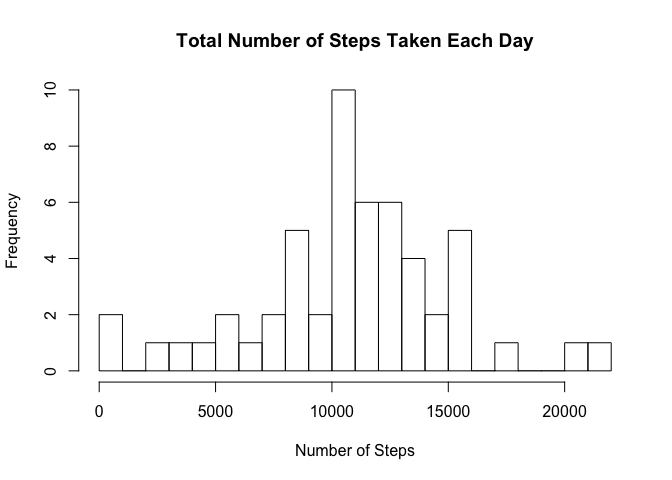
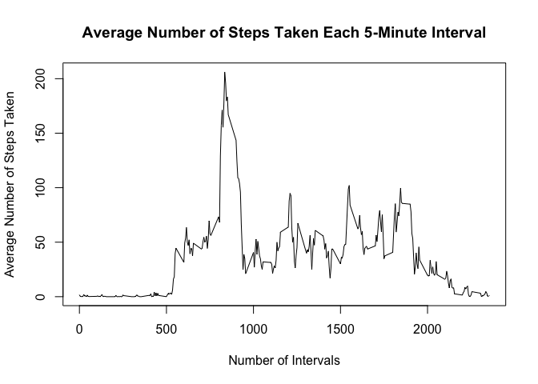
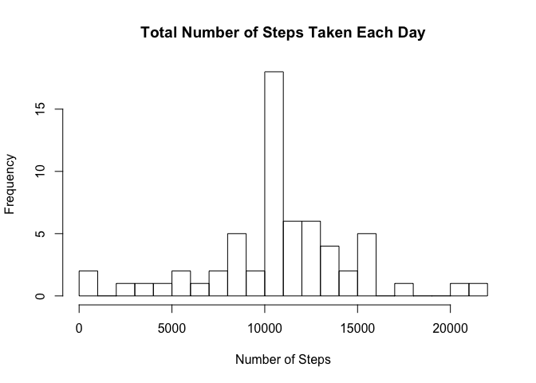
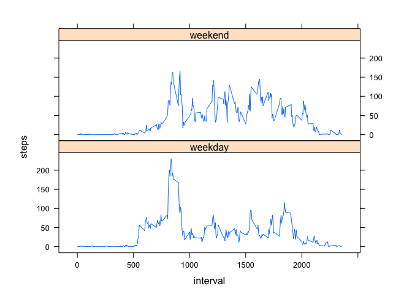

# Reproducible Research: Peer Assessment 1


## Loading and preprocessing the data

1. Load the data (i.e. read.csv())

```r
if(!file.exists('activity.csv')) {
  
  unzip('activity.zip')
}
activitydata <- read.csv('activity.csv')

head(activitydata)
```

```
##   steps       date interval
## 1    NA 2012-10-01        0
## 2    NA 2012-10-01        5
## 3    NA 2012-10-01       10
## 4    NA 2012-10-01       15
## 5    NA 2012-10-01       20
## 6    NA 2012-10-01       25
```

```r
str(activitydata)
```

```
## 'data.frame':	17568 obs. of  3 variables:
##  $ steps   : int  NA NA NA NA NA NA NA NA NA NA ...
##  $ date    : Factor w/ 61 levels "2012-10-01","2012-10-02",..: 1 1 1 1 1 1 1 1 1 1 ...
##  $ interval: int  0 5 10 15 20 25 30 35 40 45 ...
```

```r
summary(activitydata)
```

```
##      steps                date          interval     
##  Min.   :  0.00   2012-10-01:  288   Min.   :   0.0  
##  1st Qu.:  0.00   2012-10-02:  288   1st Qu.: 588.8  
##  Median :  0.00   2012-10-03:  288   Median :1177.5  
##  Mean   : 37.38   2012-10-04:  288   Mean   :1177.5  
##  3rd Qu.: 12.00   2012-10-05:  288   3rd Qu.:1766.2  
##  Max.   :806.00   2012-10-06:  288   Max.   :2355.0  
##  NA's   :2304     (Other)   :15840
```

2. Process/transform the data (if necessary) into a format suitable for your analysis

```r
activitydata$date <- as.Date(activitydata$date)
```

## What is mean total number of steps taken per day?
For this part of the assignment, we may ignore the missing values in the dataset.

1. Calculate the total number of steps taken per day

```r
steps_by_day <- aggregate(steps ~ date, data = activitydata, sum, na.rm = TRUE)
steps_by_day
```

```
##          date steps
## 1  2012-10-02   126
## 2  2012-10-03 11352
## 3  2012-10-04 12116
## 4  2012-10-05 13294
## 5  2012-10-06 15420
## 6  2012-10-07 11015
## 7  2012-10-09 12811
## 8  2012-10-10  9900
## 9  2012-10-11 10304
## 10 2012-10-12 17382
## 11 2012-10-13 12426
## 12 2012-10-14 15098
## 13 2012-10-15 10139
## 14 2012-10-16 15084
## 15 2012-10-17 13452
## 16 2012-10-18 10056
## 17 2012-10-19 11829
## 18 2012-10-20 10395
## 19 2012-10-21  8821
## 20 2012-10-22 13460
## 21 2012-10-23  8918
## 22 2012-10-24  8355
## 23 2012-10-25  2492
## 24 2012-10-26  6778
## 25 2012-10-27 10119
## 26 2012-10-28 11458
## 27 2012-10-29  5018
## 28 2012-10-30  9819
## 29 2012-10-31 15414
## 30 2012-11-02 10600
## 31 2012-11-03 10571
## 32 2012-11-05 10439
## 33 2012-11-06  8334
## 34 2012-11-07 12883
## 35 2012-11-08  3219
## 36 2012-11-11 12608
## 37 2012-11-12 10765
## 38 2012-11-13  7336
## 39 2012-11-15    41
## 40 2012-11-16  5441
## 41 2012-11-17 14339
## 42 2012-11-18 15110
## 43 2012-11-19  8841
## 44 2012-11-20  4472
## 45 2012-11-21 12787
## 46 2012-11-22 20427
## 47 2012-11-23 21194
## 48 2012-11-24 14478
## 49 2012-11-25 11834
## 50 2012-11-26 11162
## 51 2012-11-27 13646
## 52 2012-11-28 10183
## 53 2012-11-29  7047
```

2. Make a histogram of the total number of steps taken each day

```r
hist(steps_by_day$steps, breaks = 20, main = "Total Number of Steps Taken Each Day", xlab="Number of Steps")
```

<!-- -->

3. Calculate and report the mean and median of the total number of steps taken per day

```r
steps_mean <- mean(steps_by_day$steps, na.rm = TRUE)
print(paste("The mean of the total number of steps taken per day is", steps_mean))
```

```
## [1] "The mean of the total number of steps taken per day is 10766.1886792453"
```

```r
steps_median <- median(steps_by_day$steps, na.rm = TRUE)
print(paste("The median of the total number of steps taken per day is", steps_median))
```

```
## [1] "The median of the total number of steps taken per day is 10765"
```

## What is the average daily activity pattern?

1. Make a time series plot (i.e. type = "l") of the 5-minute interval (x-axis) and the average number of steps taken, averaged across all days (y-axis)

```r
steps_by_interval <- aggregate(steps ~ interval, data = activitydata, mean, na.rm=TRUE)
plot(steps_by_interval$interval, steps_by_interval$steps, type = "l", main = "Average Number of Steps Taken Each 5-Minute Interval", xlab = "Number of Intervals", ylab = "Average Number of Steps Taken")
```

<!-- -->

2. Which 5-minute interval, on average across all the days in the dataset, contains the maximum number of steps?

```r
max_steps_by_interval <- steps_by_interval[which(steps_by_interval$steps == max(steps_by_interval$steps)), ]
print(paste("The 5-minute interval, on average across all the days in the dataset, contains the maximum number of steps is", max_steps_by_interval$interval, "and the number of steps is", max_steps_by_interval$steps))
```

```
## [1] "The 5-minute interval, on average across all the days in the dataset, contains the maximum number of steps is 835 and the number of steps is 206.169811320755"
```

## Imputing missing values
Note that there are a number of days/intervals where there are missing values (coded as NA). The presence of missing days may introduce bias into some calculations or summaries of the data.

1. Calculate and report the total number of missing values in the dataset (i.e. the total number of rows with NAs)

```r
num_of_steps <- sum(is.na(activitydata$steps))
print(paste("The total number of missing values in the dataset is", num_of_steps))
```

```
## [1] "The total number of missing values in the dataset is 2304"
```

2. Devise a strategy for filling in all of the missing values in the dataset. The strategy does not need to be sophisticated. We use the the mean for that 5-minute interval to fill in all of the missing values in the dataset.

```r
activitydata_raw <- activitydata
mean_steps_by_interval <- tapply(activitydata_raw$steps, activitydata_raw$interval, mean, na.rm = TRUE, simplify = TRUE)
```

3. Create a new dataset that is equal to the original dataset but with the missing data filled in.

```r
activitydata_new <- activitydata_raw
nas <- is.na(activitydata_raw$steps)
activitydata_new$steps[nas] <- mean_steps_by_interval[as.character(activitydata_raw$interval[nas])]
```

4. Make a histogram of the total number of steps taken each day and Calculate and report the mean and median total number of steps taken per day. Do these values differ from the estimates from the first part of the assignment? What is the impact of imputing missing data on the estimates of the total daily number of steps?

```r
steps_by_day <- aggregate(steps ~ date, data = activitydata_new, sum, na.rm = TRUE)
steps_by_day
```

```
##          date    steps
## 1  2012-10-01 10766.19
## 2  2012-10-02   126.00
## 3  2012-10-03 11352.00
## 4  2012-10-04 12116.00
## 5  2012-10-05 13294.00
## 6  2012-10-06 15420.00
## 7  2012-10-07 11015.00
## 8  2012-10-08 10766.19
## 9  2012-10-09 12811.00
## 10 2012-10-10  9900.00
## 11 2012-10-11 10304.00
## 12 2012-10-12 17382.00
## 13 2012-10-13 12426.00
## 14 2012-10-14 15098.00
## 15 2012-10-15 10139.00
## 16 2012-10-16 15084.00
## 17 2012-10-17 13452.00
## 18 2012-10-18 10056.00
## 19 2012-10-19 11829.00
## 20 2012-10-20 10395.00
## 21 2012-10-21  8821.00
## 22 2012-10-22 13460.00
## 23 2012-10-23  8918.00
## 24 2012-10-24  8355.00
## 25 2012-10-25  2492.00
## 26 2012-10-26  6778.00
## 27 2012-10-27 10119.00
## 28 2012-10-28 11458.00
## 29 2012-10-29  5018.00
## 30 2012-10-30  9819.00
## 31 2012-10-31 15414.00
## 32 2012-11-01 10766.19
## 33 2012-11-02 10600.00
## 34 2012-11-03 10571.00
## 35 2012-11-04 10766.19
## 36 2012-11-05 10439.00
## 37 2012-11-06  8334.00
## 38 2012-11-07 12883.00
## 39 2012-11-08  3219.00
## 40 2012-11-09 10766.19
## 41 2012-11-10 10766.19
## 42 2012-11-11 12608.00
## 43 2012-11-12 10765.00
## 44 2012-11-13  7336.00
## 45 2012-11-14 10766.19
## 46 2012-11-15    41.00
## 47 2012-11-16  5441.00
## 48 2012-11-17 14339.00
## 49 2012-11-18 15110.00
## 50 2012-11-19  8841.00
## 51 2012-11-20  4472.00
## 52 2012-11-21 12787.00
## 53 2012-11-22 20427.00
## 54 2012-11-23 21194.00
## 55 2012-11-24 14478.00
## 56 2012-11-25 11834.00
## 57 2012-11-26 11162.00
## 58 2012-11-27 13646.00
## 59 2012-11-28 10183.00
## 60 2012-11-29  7047.00
## 61 2012-11-30 10766.19
```

```r
hist(steps_by_day$steps, breaks = 20, main = "Total Number of Steps Taken Each Day", xlab="Number of Steps")
```

<!-- -->

```r
steps_mean <- mean(steps_by_day$steps, na.rm = TRUE)
print(paste("The mean of the total number of steps taken per day is", steps_mean))
```

```
## [1] "The mean of the total number of steps taken per day is 10766.1886792453"
```

```r
steps_median <- median(steps_by_day$steps, na.rm = TRUE)
print(paste("The median of the total number of steps taken per day is", steps_median))
```

```
## [1] "The median of the total number of steps taken per day is 10766.1886792453"
```
The impact of filling in all of the missing values in the dataset with the average number of steps in the same 5-minute interval is that both the mean and the median are equal to each other.

## Are there differences in activity patterns between weekdays and weekends?
For this part the weekdays() function may be of some help here. Use the dataset with the filled-in missing values for this part.

1. Create a new factor variable in the dataset with two levels – “weekday” and “weekend” indicating whether a given date is a weekday or weekend day.

```r
activitydata_new$day <- weekdays(activitydata_new$date)
activitydata_new$daytype <- as.factor(ifelse(activitydata_new$day == "Saturday" | activitydata_new$day == "Sunday", "weekend", "weekday"))
head(activitydata_new)
```

```
##       steps       date interval    day daytype
## 1 1.7169811 2012-10-01        0 Monday weekday
## 2 0.3396226 2012-10-01        5 Monday weekday
## 3 0.1320755 2012-10-01       10 Monday weekday
## 4 0.1509434 2012-10-01       15 Monday weekday
## 5 0.0754717 2012-10-01       20 Monday weekday
## 6 2.0943396 2012-10-01       25 Monday weekday
```

2. Make a panel plot containing a time series plot (i.e. type = "l") of the 5-minute interval (x-axis) and the average number of steps taken, averaged across all weekday days or weekend days (y-axis).

```r
library(lattice)
plotdata <- aggregate(steps ~ interval + daytype, activitydata_new, mean)
xyplot(steps ~ interval | factor(daytype), data = plotdata, aspect = 1/3, type = "l")
```

<!-- -->
